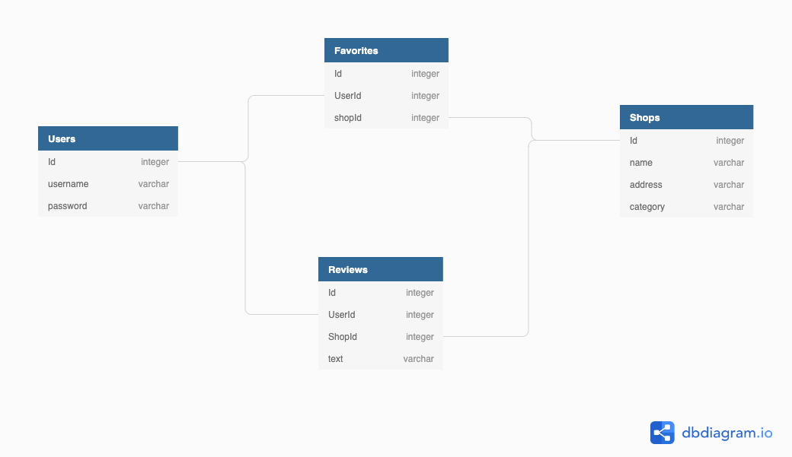

## "The Ramenator" by Phil Griswold

"The Ramenator" is an app for Ramen lovers who are planning a trip to or are already located in Tokyo, Japan.  Because Tokyo has tens of thousands of Ramen shops, this app narrows down the selection to the best of the best for the user.  It gives the user the name, address, style, and a short description of each shop and then allows the user to record their thoughts about each shop after they've visited it.  The user may also add select shops to a "favorites" page on the app.

### Technology used

"The Ramenator" uses React, reactstrap, and bootstrap technologies.

### MVP

1. Have a user able to login or register on a landing page.
2. Have a homepage that would display various Ramen shops on cards with a details button.
3. Have a details button take the user to a page with a detailed description, a favorites button, and a review button.
4. Allow the favorites button to save the favorites page.
5. Have the review button allow the user to write, save, and edit a review.
6. Have a logout button take the user back to the landing page...

### User Stories

- As a lover of Ramen, I want someone to narrow down an otherwise endless selection of shops to a small list of "must visits".
- I want to be able to login existing users or register new users.
- I want an app to lure me in with pictures and then provide me a button to click that will allow me to see more details about a shop.
- I want the details of shop to include name, address, style, and a short description.
- I want to be able to record my thoughts regarding each shop that I can then edit or delete using my own discretion.
- I want to be able to favorite certain shop locations that I may want to revisit and I also want to be able delete them in case I change my mind. 
- I want to be able to logout at any time and it take me back to the landing page.

